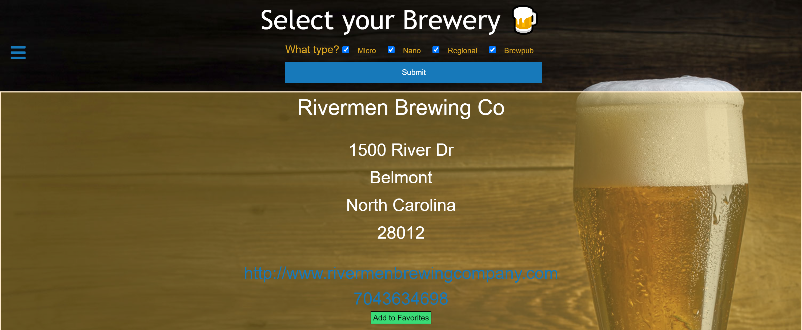

# Food-GeoLocation-Search-

* As a user, I want to be able to search in my immediate area for breweries. 
* When I enter the website, I'm greeted with a list of breweries based on my IP address location. 
* Then, I'm allowed to filter the list with a modal that provides filtering options. 
* When I filter the list, then the API will receive a call to update the list with my additional search information. 
* When the breweries list pops up, it will provide me with name, address, website & phone number. 
* When the brewery information pops up, I'm able to click on the website & phone number to allow me to dial or visit the website. 
* If I like a specific brewery, then I am able to save to local storage as a favorite. 
* When I click the favorites button, then I will fetch from local storage and display the favorites list in updated HTML
  
## Author
* Marlon Liemann
* Nelson Chao
* Tyler Davis
    

## Review URL
[GitHub](https://github.com/nchao98/Food-GeoLocation-Search-) &nbsp; | &nbsp; 
[Live](https://nchao98.github.io/Food-GeoLocation-Search-/)

#

